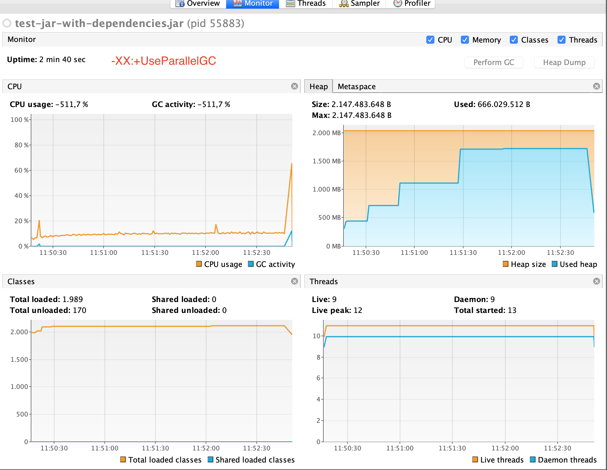
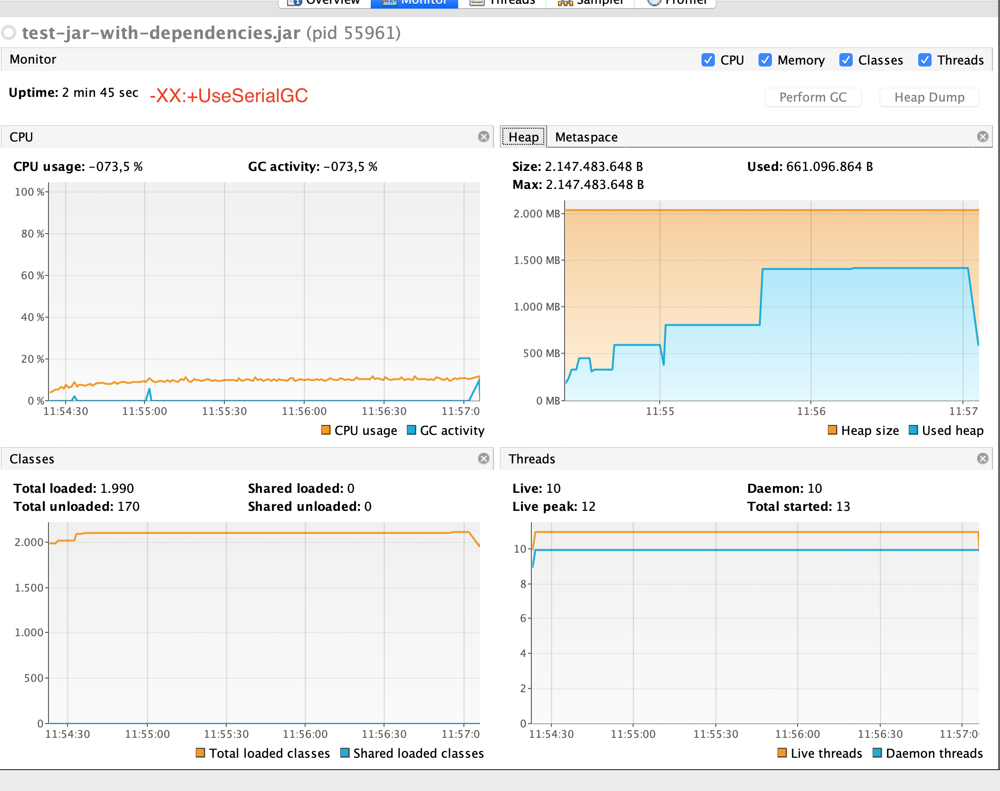
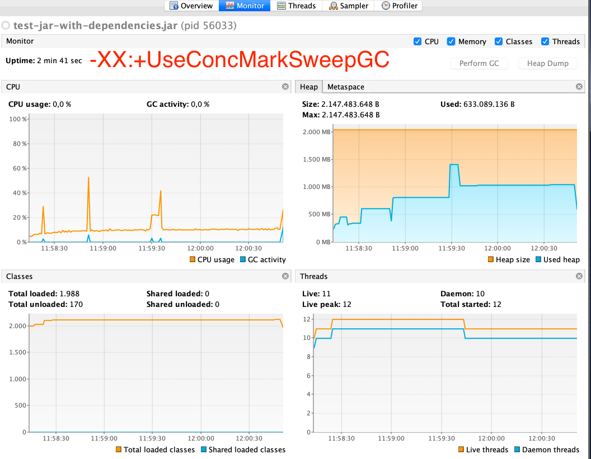
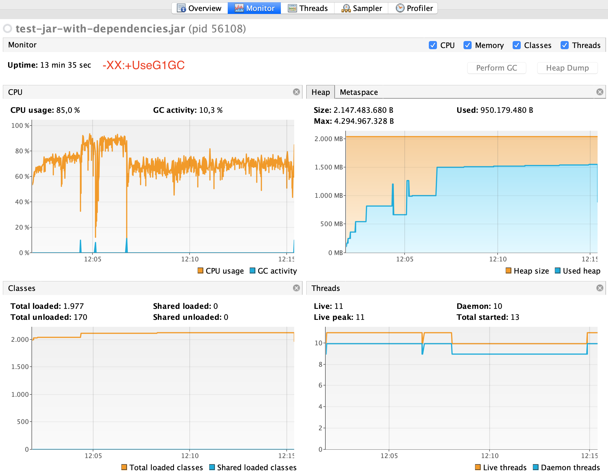

Report:

common params:
`-Xms2048m -Xmx2048m`

Objects count: 10000


###-XX:+UseParallelGC
```
Worked time, sec: 160
start:156381 Name:PS MarkSweep, action:end of major GC, gcCause:Ergonomics(2377 ms)
start:158758 Name:PS Scavenge, action:end of minor GC, gcCause:Allocation Failure(3 ms)
start:158761 Name:PS MarkSweep, action:end of major GC, gcCause:Allocation Failure(1897 ms)
Report:
All GC Duration (ms): 2579; Min duration: 202; Max duration: 2377
All GC duration / Worked Time: 0.016069837
ADD operation count: 315 354 907
Operation per sec: 1970968
```



###-XX:+UseSerialGC
```
Worked time, sec: 165
start:162066 Name:Copy, action:end of minor GC, gcCause:Allocation Failure(1583 ms)
start:163649 Name:MarkSweepCompact, action:end of major GC, gcCause:Allocation Failure(959 ms)
start:164609 Name:MarkSweepCompact, action:end of major GC, gcCause:Allocation Failure(786 ms)
Report:
All GC Duration (ms): 3323; Min duration: 192; Max duration: 1583
All GC duration / Worked Time: 0.020117205
ADD operation count: 315 354 907
Operation per sec: 1911241
```


###-XX:+UseConcMarkSweepGC
```
Worked time, sec: 160
start:159039 Name:ParNew, action:end of minor GC, gcCause:Allocation Failure(424 ms)
start:159463 Name:ConcurrentMarkSweep, action:end of major GC, gcCause:Allocation Failure(892 ms)
start:160355 Name:ConcurrentMarkSweep, action:end of major GC, gcCause:Allocation Failure(778 ms)
Report:
All GC Duration (ms): 8433; Min duration: 235; Max duration: 6328
All GC duration / Worked Time: 0.052405246
ADD operation count: 315 354 907
Operation per sec: 1970968
```


###-XX:+UseG1GC
```
Worked time, sec: 815
start:814825 Name:G1 Young Generation, action:end of minor GC, gcCause:G1 Humongous Allocation(1 ms)
start:814827 Name:G1 Young Generation, action:end of minor GC, gcCause:G1 Humongous Allocation(0 ms)
start:814827 Name:G1 Old Generation, action:end of major GC, gcCause:G1 Humongous Allocation(541 ms)
start:815368 Name:G1 Old Generation, action:end of major GC, gcCause:G1 Humongous Allocation(485 ms)
Report:
All GC Duration (ms): 6753; Min duration: 0; Max duration: 1848
All GC duration / Worked Time: 0.008279398
ADD operation count: 473057360
Operation per sec: 580438
```


###Conclusions:

G1GC is a leader by working time and amount of finished iterations. Downside that it created persistent high load on CPU and max heap increased to 4g(minimal heap size for G1)   
 
 ####Used links:
https://habr.com/ru/post/269621/
https://habr.com/ru/post/269707/
https://habr.com/ru/post/269863/